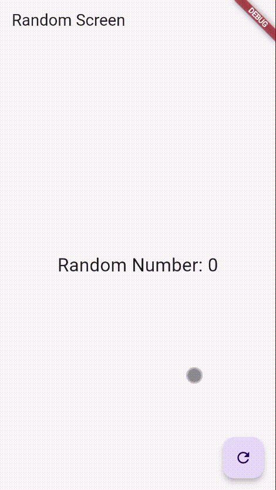

# bloc_random_naufal

# Capture Hasil Praktikum 7

# Penjelasan untuk praktikum ini
    Kode RandomNumberBloc adalah bagian inti dari pola BLoC (Business Logic Component) yang kamu terapkan. BLoC bertugas memisahkan logika bisnis (menghasilkan angka acak) dari antarmuka pengguna.
    Konsep BLocnya berada pada Input-Output yaitu genereteRandom dan randomNumber. Stream sebaagai penghubungnya yang menghubungkan logika bisnis dengan UI tanpa adanya ketergantungan langsung

A new Flutter project.

## Getting Started

This project is a starting point for a Flutter application.

A few resources to get you started if this is your first Flutter project:

- [Lab: Write your first Flutter app](https://docs.flutter.dev/get-started/codelab)
- [Cookbook: Useful Flutter samples](https://docs.flutter.dev/cookbook)

For help getting started with Flutter development, view the
[online documentation](https://docs.flutter.dev/), which offers tutorials,
samples, guidance on mobile development, and a full API reference.
